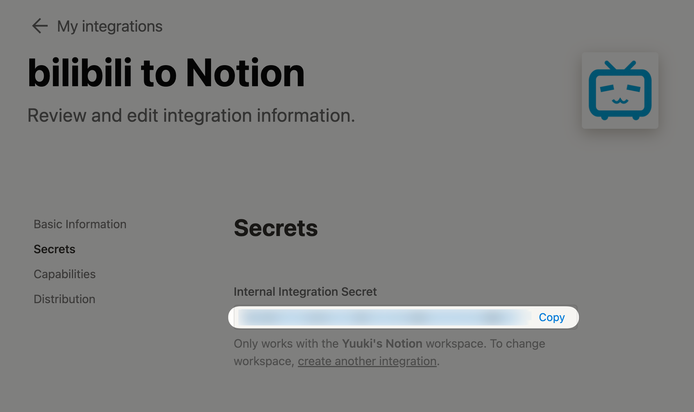
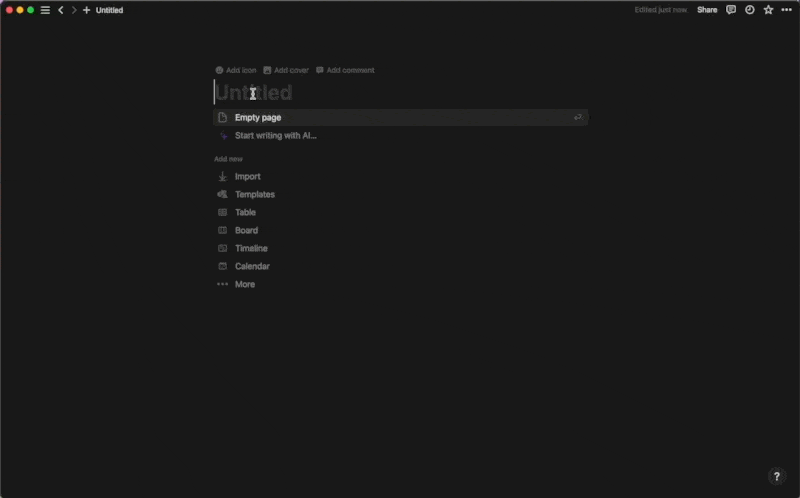
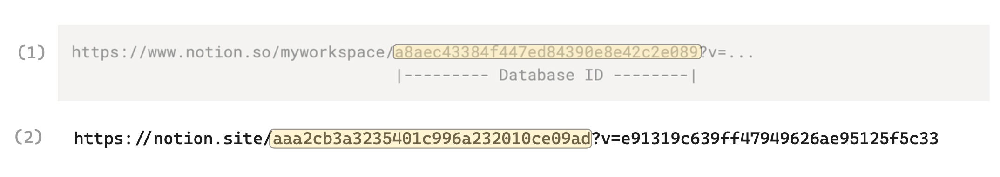
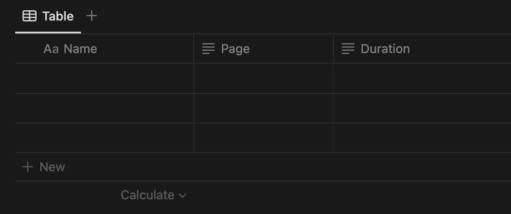
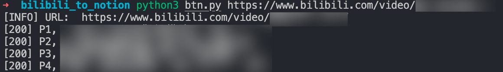
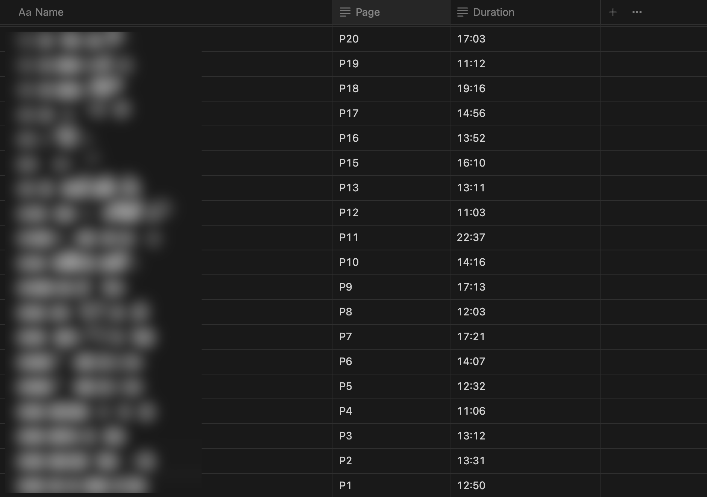
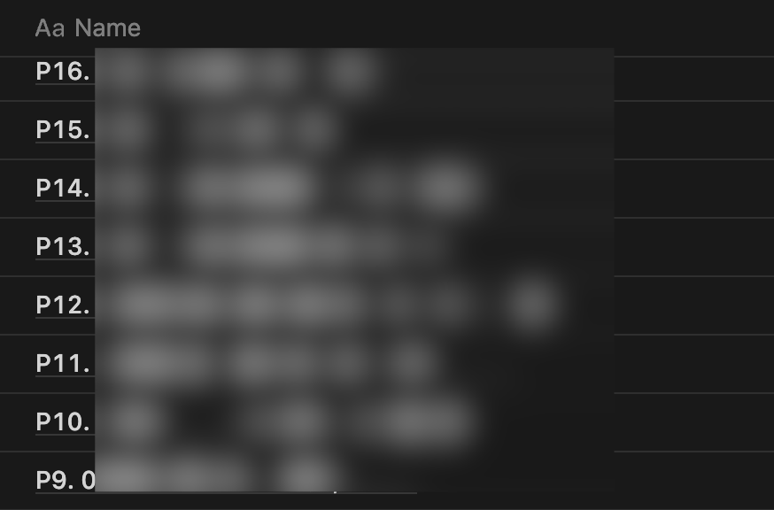

# bilibili to Notion

根据 URL 获取 bilibili 视屏合集名称、视频时长, 导入到 Notion Database

* [使用方法](#使用方法)
    * [Step 1: 克隆项目到本地, 安装依赖](#step-1-克隆项目到本地-安装依赖)
    * [Step 2: 获取 Notion Database ID 和 Notion API Key](#step-2-获取-notion-database-id-和-notion-api-key)
    * [Step 3: 将 Database ID 和 Notion API Key 填入配置文件](#step-3-将-database-id-和-notion-api-key-填入配置文件)
    * [Step 4: 配置 Notion Database](#step-4-配置-notion-database)
    * [Step 5: 运行脚本](#step-5-运行脚本)

## 使用方法

### Step 1: 克隆项目到本地, 安装依赖

```bash
git clone https://github.com/uuk1/bilibili-to-Notion.git
cd bilibili-to-Notion
python3 -m pip install -r requirements.txt
```

### Step 2: 获取 Notion Database ID 和 Notion API Key

1) 进入 https://www.notion.so/my-integrations 创建 Notion integrations, 保留 secret_ 开头的内容作为 `Notion API Key`



2. 在 Notion 创建 Full Page Database, 公开页面, 获取 `Database ID`, 接入 Notion integrations



`Database ID` 在两种情况下, 如下图中高亮部分所示



### Step 3: 将 Database ID 和 Notion API Key 填入配置文件

将 `Notion API Key` 填入 notion_api_key = 后面的 YOU_API_KEY

将 `Notion Database ID` 填入 notion_database_id = 后面的 YOUR_DATABASE_ID

### Step 4: 配置 Notion Database

1. 确保 Name 属性存在
2. 确保 `Page` 和 `Duration` 属性存在, 并且类型都为 `Text`



### Step 5: 运行脚本

```bash
python3 btn.py URL
```

直接填入包含合集的 URL 运行程序即可完成导入





**补充说明**

脚本内置了 allin 参数, 将 Page, Name, Duration 全部放在了一个属性下。使用 allin 参数将不需要 Page 和 Duration 属性

```bash
python3 btn.py URL allin
```


